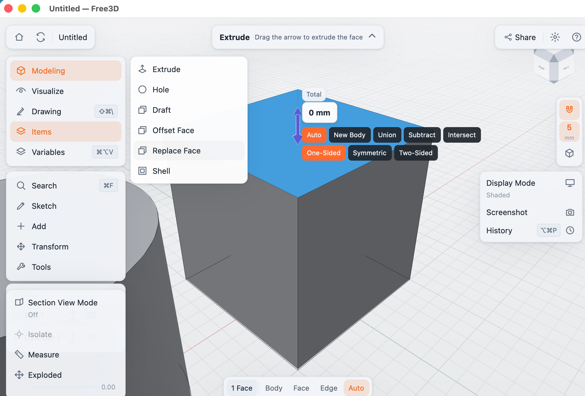

# Free3D

**A free, open-source 3D CAD app with the direct-modeling feel of Shapr3D.**

Select a face and pull it. Drag an edge to round it. Free3D is a desktop CAD application for people who want to design real, manufacturable parts without wrestling with a traditional CAD interface — and without a subscription.



## What it does

- **Model by direct manipulation.** Click a face and an arrow appears — drag out to add material, push in to cut. Drag an edge outward for a fillet, inward for a chamfer. Type a number at any time for an exact value.
- **Real B-rep geometry, not meshes.** Free3D is built on the OpenCASCADE kernel, the same class of exact geometry used by professional CAD. Your parts have true faces, edges, and dimensions.
- **Full workflow in one app.** Sketching with constraints, solid and surface modeling, assemblies with joints, measurement and interference checks, and 2D drawings with dimensions and a parts list — exported to SVG/PDF.
- **Works with your other tools.** Import and export STEP and IGES; import STL/OBJ/DXF; export OBJ, glTF, 3MF, and STL for printing and rendering.
- **A home for your designs.** A design library with thumbnails opens on launch; projects are single `.f3d` files you can back up, sync, or share however you like. Autosave and crash recovery are built in.
- **Made for the desktop.** GPU-accelerated interface, touchpad-first navigation (two-finger orbit, pinch to zoom), light and dark themes, localized interface.

## Why Free3D

Shapr3D showed how approachable direct modeling can be. FreeCAD showed how much a community-owned CAD tool matters. Free3D aims at the intersection: the interaction design of the former, the freedom of the latter — local files, no account, MIT-licensed code.

## Getting started

**[Download the latest release](../../releases/latest)** for macOS, Windows, or Linux — each build is a single self-contained file with everything statically linked. No installer, no runtimes, no additional dependencies: unpack and run.

Free3D targets all desktop platforms and is currently developed and tested primarily on macOS — if you hit a problem elsewhere, please [open an issue](../../issues). The macOS app is not yet code-signed: the first time, right-click it and choose Open.

**First steps:**

1. Click **New Design** in the library.
2. Open **Add** in the left rail and place a Box.
3. Click a face — drag the arrow to pull or cut. Type a number for an exact distance.
4. Click an edge and drag away from the body to round it.
5. ⌘S / Ctrl+S saves the design to your library.

| Navigate | Touchpad | Mouse |
|---|---|---|
| Orbit | Two-finger drag | Right-button drag |
| Pan | Shift + two-finger drag | Middle-button drag |
| Zoom | Pinch | Scroll wheel |

## Building from source

You only need [Rust](https://rustup.rs) and [CMake](https://cmake.org/download/):

```sh
git clone https://github.com/Tryanks/Free3D.git
cd Free3D
cargo run --release
```

The first build compiles the OpenCASCADE kernel from source and takes a while (about 15 minutes); after that, builds are fast. See the [contributing guide](CONTRIBUTING.md) for development tips.

## Getting help

- **Questions and bugs:** [GitHub Issues](../../issues)
- **Ideas and feature requests:** open an issue and tell us what you're trying to build

## Project status

Free3D is young and moving fast. The core modeling workflow is usable today; expect rough edges, and keep backups of important work. The `.f3d` format may still evolve.

## Contributing

Contributions are very welcome — code, bug reports, translations, and design feedback alike. Start with the [contributing guide](CONTRIBUTING.md). This project follows a [code of conduct](CODE_OF_CONDUCT.md).

## License

Free3D is [MIT licensed](LICENSE). It statically links [OpenCASCADE](https://www.opencascade.com/open-cascade-technology/), which is licensed under LGPL-2.1 with exception; comply with its terms when distributing binaries.
